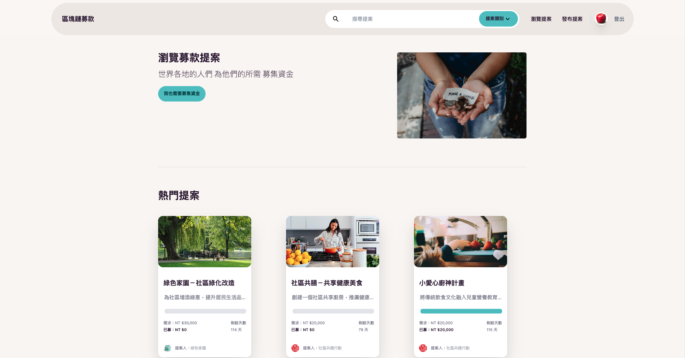

 ## 基於區塊鏈技術的募款平台

為提高捐款者對募款平台的信任並激發更多的捐款意願，我結合區塊鏈技術與傳統的募款網頁前端。這將確保每一筆金流都具有極高的透明度，因為捐款者可以輕鬆地在區塊鏈上查詢到相關的交易資訊

---
前端部分採用React和daisyUI，編譯工具使用Vite。後端選用MongoDB作為資料庫。而區塊鏈則搭建於Polygon Mumbai測試鏈上。
---

 ## Demo：
 https://6464afd9ba2b1c1f5b827999--sensational-rabanadas-0d17de.netlify.app/
 
 ### 管理員帳密：
 `admin@gmail.com/admin123`(進行區塊鏈操作需要有MetaMask：<https://metamask.io/>。錢包需要切換至Mumbai測試鏈，點擊Connect可自動切換：<https://chainlist.org/?testnets=true&search=Mumbai>，且錢包內要有測試代幣用做GasFee，可於此網址領取：https://mumbaifaucet.com/)
 
 ### 用戶帳密：
 `test@gmail.com/test123`（或直接於網頁上註冊帳號）

 ---

 ## 部分截圖

--

